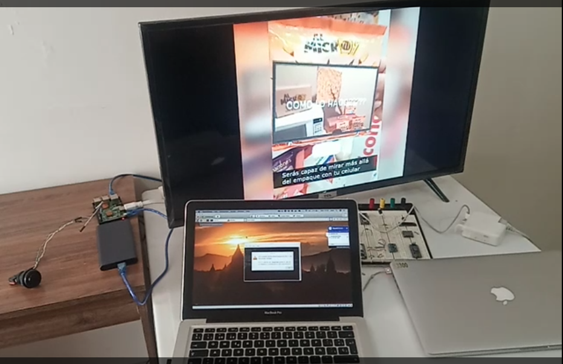

# Raspberry_video
This a project which uses omxplayer in order to play a video through GPIO2 in a Raspberry pi 3.

<p align="center">
  
</p>

<p align="center">
<iframe width="640" height="360" frameborder="0" src="https://mega.nz/embed#!y9tz2IpZ!d_0xNAKIeETheC7AT5FQ1GVkp_OiOllC4qo6xMnNoBQ" allowfullscreen></iframe>
</p>

The video is [here](https://mega.nz/#!y9tz2IpZ!d_0xNAKIeETheC7AT5FQ1GVkp_OiOllC4qo6xMnNoBQ)

## Instructions
  - Setup Raspbian
  - Install python3
  - Install omxplayer
  - Install omxplayer_python_wrapper


## Setup

> update and install these package first

```shell
$ sudo apt-get update && sudo apt-get install -y omxplayer
$ sudo apt-get update && sudo apt-get install -y libdbus-1-dev
$ pip3 install omxplayer-wrapper
```

## Run at startup
  - Copy al files into root folder
  - Open autostart file
  ```shell
    $ sudo nano /etc/xdg/lxsession/LXDE-pi/autostart
  ```
  - Add this line @lxterminal --command="./script.sh"

## License

[](http://badges.mit-license.org)

- **[MIT license](http://opensource.org/licenses/mit-license.php)**
- Author: <a href="https://www.jonathanvargas.ml" target="_blank">Jonathan Vargas</a>